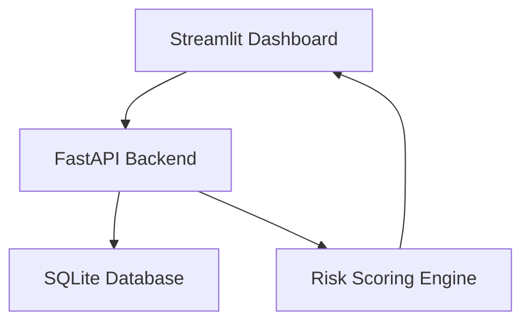

Great — here is your **complete, final, polished `README.md` file**, fully formatted, color‑enhanced, GitHub‑ready, and ready for you to paste directly into your repository.

You can copy **everything below** and paste it straight into your `README.md`.

---

# <span style="color:#4FC3F7;">🚨 UEBA‑Driven Insider Threat Detection & Risk Scoring Platform</span>

A modular, explainable, end‑to‑end **User & Entity Behavior Analytics (UEBA)** system for detecting insider threats, anomalous behavior, and high‑risk user activity.

---

## <span style="color:#81D4FA;">📘 Table of Contents</span>

- **Project Overview**  
- **Architecture**  
- **Folder Structure**  
- **Installation**  
- **Running the Application**  
- **Features**  
- **Tech Stack**  
- **Screenshots**  
- **Future Enhancements**  
- **License**  

---

# <span style="color:#4DD0E1;">🌐 Project Overview</span>

This platform transforms raw user activity logs into **actionable insider‑risk intelligence** using:

- FastAPI backend  
- Statistical anomaly scoring  
- Streamlit dashboard  
- SQLite event storage  
- Event simulation tools  

It is designed to be:

- Lightweight  
- Modular  
- Explainable  
- Analyst‑friendly  
- Portfolio‑ready  

Explore core concepts:  
- **UEBA**  
- **Insider Threat Detection**  
- **Risk Scoring**  

---

# <span style="color:#BA68C8;">🏗️ System Architecture</span>

## **High‑Level Architecture Diagram (ASCII)**

```
                ┌──────────────────────────┐
                │      Streamlit UI        │
                │  (Analyst Dashboard)     │
                └─────────────┬────────────┘
                              │
                              ▼
                ┌──────────────────────────┐
                │        FastAPI API        │
                │  /events  /score  /users  │
                └─────────────┬────────────┘
                              │
                              ▼
                ┌──────────────────────────┐
                │        SQLite DB          │
                │  (Events, Scores, Users)  │
                └──────────────────────────┘
```

---

## **Mermaid Architecture Diagram**



---

# <span style="color:#FFB74D;">📁 Folder Structure</span>

```
ueba-project/
│
├── backend/
│   ├── app/
│   │   ├── __init__.py
│   │   ├── main.py
│   │   ├── models.py
│   │   ├── schemas.py
│   │   ├── database.py
│   │   ├── scoring.py
│   │   └── utils.py
│   ├── requirements.txt
│
├── dashboard/
│   ├── app.py
│   ├── components/
│   │   ├── charts.py
│   │   ├── tables.py
│   │   └── controls.py
│   ├── services/
│   │   └── api_client.py
│   ├── requirements.txt
│
├── data/
│   ├── events.db
│   └── samples/
│
├── README.md
├── .gitignore
└── LICENSE
```

---

# <span style="color:#AED581;">⚙️ Installation</span>

## **1. Clone the Repository**
```bash
git clone https://github.com/yourusername/ueba-project.git
cd ueba-project
```

---

## **2. Install Backend Dependencies**
```bash
cd backend
pip install -r requirements.txt
```

---

## **3. Install Dashboard Dependencies**
```bash
cd ../dashboard
pip install -r requirements.txt
```

---

# <span style="color:#4DB6AC;">🚀 Running the Application</span>

## **Start the Backend**
```bash
cd backend
uvicorn app.main:app --reload
```

---

## **Start the Dashboard**
```bash
cd dashboard
streamlit run app.py
```

---

## **Workflow**
1. Select a date  
2. Generate sample events  
3. Run scoring job  
4. View high‑risk users  
5. Adjust risk thresholds  

---

# <span style="color:#90CAF9;">✨ Features</span>

- Real‑time event ingestion  
- Daily risk scoring  
- UEBA‑style anomaly detection  
- Interactive dashboard  
- Event simulation  
- Explainable scoring logic  
- Modular architecture  

---

# <span style="color:#F48FB1;">🛠️ Tech Stack</span>

- **FastAPI** — backend API  
- **SQLAlchemy + SQLite** — data storage  
- **Streamlit** — dashboard  
- **Python** — core logic  
- **Requests** — API communication  

---

# <span style="color:#CE93D8;">📸 Screenshots (Optional)</span>

Add your screenshots here:

```
/screenshots
    dashboard.png
    risk_scores.png
    events_table.png
```

---

# <span style="color:#FFAB91;">🔮 Future Enhancements</span>

- Machine‑learning‑based anomaly detection  
- Role‑based access control  
- Real‑time streaming ingestion (Kafka)  
- Multi‑tenant SOC dashboard  
- Integration with SIEM tools  

---

# <span style="color:#B0BEC5;">📄 License</span>

MIT License or your preferred license.

---

If you want, I can also generate:

- A **dark‑mode optimized version**  
- A **badge‑enhanced version**  
- A **version with real architecture images**  

Choose one:  
**Dark Mode README**  
**Badge Version**  
**Image Architecture Version**
